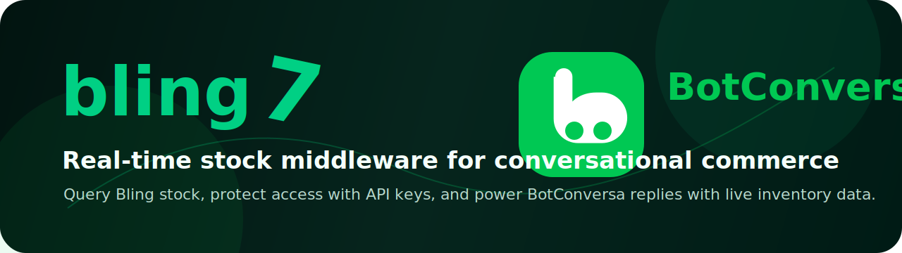
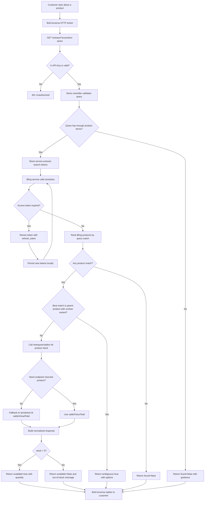

<p align="center">
  
</p>

# Bling Stock API for BotConversa

Beautifully small middleware that connects **Bling v3** inventory data to **BotConversa** flows.

It receives a natural product query, searches the real Bling catalog, ranks possible matches, checks live stock, and returns a clean JSON response that a chatbot can safely use to answer customers.

## Why This Exists

BotConversa is great for customer conversations, but it should not guess stock availability. This API gives your bot a reliable bridge to Bling, so every answer can be based on real inventory instead of spreadsheets, manual exports, or stale product lists.

Useful for:

- WhatsApp and Instagram product availability flows.
- Fashion stores with product variations such as color and size.
- Replacing Google Sheets or Apps Script stock workarounds.
- Keeping chatbot answers aligned with the source of truth in Bling.
- Returning structured data that can be used by GPT Actions, HTTP Actions, or custom automation.

## Features

- Real-time Bling v3 product search.
- OAuth refresh-token renewal.
- Local token persistence in `.tokens.json`.
- API key protection through `X-API-Key`.
- Product ranking for human-style search terms.
- Variant-aware matching for color and size.
- Clean Express architecture with controllers, services, routes, middleware, and config layers.
- Ready for Railway, Render, or any Node.js host.

## API Response Example

```json
{
  "found": true,
  "id": 16652947163,
  "name": "Blusa",
  "price": 25,
  "stock": 0,
  "available": false,
  "message": "Este produto nao esta disponivel no momento (estoque zerado)."
}
```

## Project Structure

```text
src/
  app.js                         # Builds the Express app
  main.js                        # Runtime entrypoint
  bin/oauth.js                   # OAuth helper CLI
  config/env.js                  # Centralized environment config
  controllers/                   # HTTP handlers
  http/middleware/               # API key and error middleware
  routes/                        # Route definitions
  services/                      # Bling API and stock business logic
  utils/                         # Matching and small helpers

docs/
  INTEGRACAO.md                  # Detailed integration notes
  ESTRUTURA.md                   # Architecture map
  assets/banner.svg              # README banner
```

## Application Logic Flow



## Requirements

- Node.js 18+
- A Bling app with:
  - Client ID
  - Client Secret
  - OAuth redirect URL configured to your deployed API
- A BotConversa flow that can call an HTTP endpoint

## Environment Variables

Create a `.env` file:

```env
BLING_CLIENT_ID=your_bling_client_id
BLING_CLIENT_SECRET=your_bling_client_secret
BLING_REFRESH_TOKEN=your_current_refresh_token

API_SECRET_KEY=your_private_api_key
PORT=3000
```

Optional:

```env
BLING_ACCESS_TOKEN=
BLING_BASE_URL=https://api.bling.com.br/Api/v3
BLING_AUTH_URL=https://www.bling.com.br/Api/v3/oauth/authorize
BLING_TOKEN_URL=https://api.bling.com.br/Api/v3/oauth/token
BLING_SYNC_ENV=true
```

## Local Development

Install dependencies:

```bash
npm install
```

Start the API:

```bash
npm run dev
```

Health check:

```bash
curl http://localhost:3000/health
```

Query stock:

```bash
curl "http://localhost:3000/estoque?q=Blusa" \
  -H "X-API-Key: your_private_api_key"
```

## OAuth Setup

Generate an authorization URL:

```bash
npm run oauth:url
```

Open the URL, authorize the app in Bling, then exchange the returned `code`:

```bash
npm run oauth:exchange -- "https://your-domain.com/?code=YOUR_CODE&state=..."
```

The script saves tokens to `.tokens.json` and updates `BLING_REFRESH_TOKEN` in `.env` when local env sync is enabled.

## Deploy

### Railway

1. Push this repository to GitHub.
2. Create a new Railway project from the GitHub repository.
3. Railway will use the `Procfile`:

```text
web: node src/main.js
```

4. Add environment variables in Railway:

```env
BLING_CLIENT_ID=...
BLING_CLIENT_SECRET=...
BLING_REFRESH_TOKEN=...
API_SECRET_KEY=...
```

5. Deploy.
6. Test:

```bash
curl https://your-api.up.railway.app/health
```

### Render

1. Create a new Web Service.
2. Connect the GitHub repository.
3. Use:

```bash
npm install
```

Build command:

```bash
npm install
```

Start command:

```bash
npm start
```

4. Add the same environment variables.
5. Deploy and test `/health`.

## Bling Redirect URL

In your Bling app settings, configure the redirect URL to your deployed API:

```text
https://your-domain.com/oauth/callback
```

The app also accepts `/?code=...`, but `/oauth/callback` is cleaner.

## BotConversa Integration

Configure an HTTP Action:

```text
GET https://your-domain.com/estoque?q={{product_query}}
```

Headers:

```text
X-API-Key: your_private_api_key
```

Use these response fields in the bot:

- `found`
- `ambiguous`
- `options`
- `id`
- `name`
- `price`
- `stock`
- `available`
- `message`

Recommended bot behavior:

- If `found` is `true`, answer using `name`, `stock`, `available`, and `message`.
- If `available` is `false`, say the product is currently out of stock.
- If `ambiguous` is `true`, ask the customer which option they mean.
- If `found` is `false`, ask for more product details such as color or size.

## Main Endpoints

### `GET /health`

Returns service status.

### `GET /estoque?q=product`

Searches Bling and returns the best stock match.

### `GET /estoque/variantes?nome=base_product_name`

Lists variants for a product family.

### `GET /oauth/url`

Returns an OAuth authorization URL.

### `GET /oauth/callback?code=...`

Exchanges a Bling authorization code for tokens.

## Security Notes

- Never commit `.env` or `.tokens.json`.
- Rotate `API_SECRET_KEY` if it is exposed.
- Keep the Bling refresh token in your deployment environment variables.
- In production hosts with ephemeral disks, update deployment variables when you manually reauthorize the app.

## License

Private project for Mariath / BotConversa stock automation.
